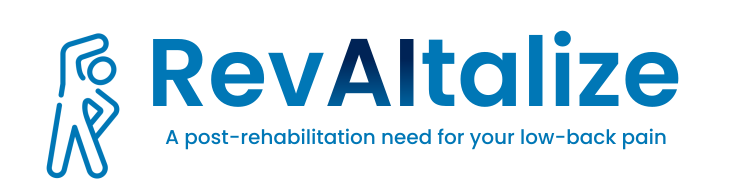
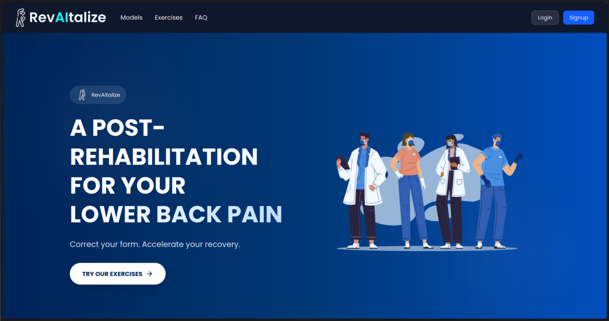
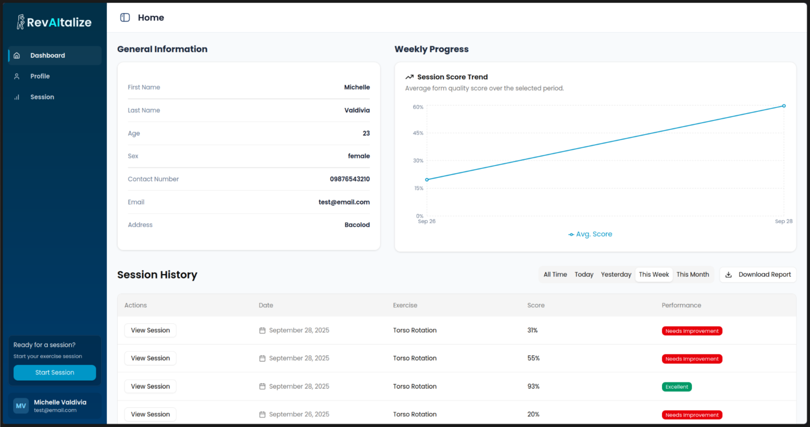
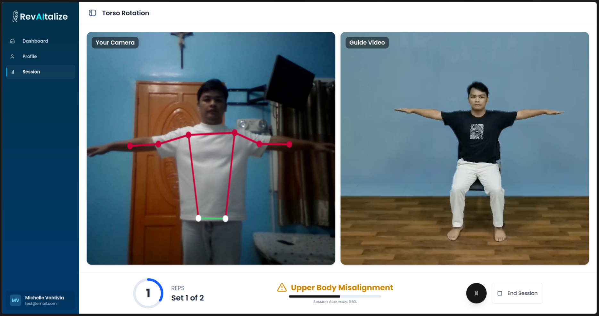

<div align="center">

  
  <h1>RevAItalize Frontend</h1>
  
  <p>
    The frontend repository for the RevAItalize website!
  </p>
  
  
<!-- Badges -->
<p>
  <a href="https://github.com/aaron-kristopher/revaitalize-frontend/graphs/contributors">
    
  </a>
  <a href="">
    
  </a>
  <a href="https://github.com/aaron-kristopher/revaitalize-frontend/network/members">
    
  </a>
  <a href="https://github.com/aaron-kristopher/revaitalize-frontend/stargazers">
    
  </a>
  <a href="https://github.com/aaron-kristopher/revaitalize-frontend/issues/">
    
  </a>
  <a href="https://opensource.org/licenses/MIT">
    
  </a>
</p>
   
<h4>
    <a href="https://github.com/aaron-kristopher/revaitalize-frontend/">View Demo</a>
  <span> · </span>
    <a href="https://github.com/aaron-kristopher/revaitalize-frontend">Documentation</a>
  <span> · </span>
    <a href="https://github.com/aaron-kristopher/revaitalize-frontend/issues/">Report Bug</a>
  <span> · </span>
    <a href="https://github.com/aaron-kristopher/revaitalize-frontend/issues/">Request Feature</a>
  </h4>
</div>

<br />

<!-- Table of Contents -->
# :notebook_with_decorative_cover: Table of Contents

- [About the Project](#star2-about-the-project)
  * [Screenshots](#camera-screenshots)
  * [Tech Stack](#space_invader-tech-stack)
  * [Environment Variables](#key-environment-variables)
- [Getting Started](#toolbox-getting-started)
  * [Prerequisites](#bangbang-prerequisites)
  * [Installation](#gear-installation)
  * [Running Tests](#test_tube-running-tests)
- [Usage](#eyes-usage)
- [License](#warning-license)
- [Contact](#handshake-contact)

<!-- About the Project -->
## :star2: About the Project
**RevAItalize** is a smart virtual companion designed to guide you through your post-rehabilitation journey.
We use artificial intelligence to analyze your exercise form in real-time, providing the expert guidance you need to heal properly and confidently.

- **AI-Powered Form Correction** – Tracks key joints and movements to ensure every stretch and rotation is performed with proper technique.
- **Accessible Anywhere, Anytime** – All you need is your device. Get expert-level guidance without appointments or special equipment.
- **Safer, Faster Recovery** – Prevents incorrect form to minimize re-injury and build correct muscle memory for efficient healing.

> ⚡ This repository contains the frontend (React + Vite) of the platform. Backend services live in [revaitalize-backend](https://github.com/aaron-kristopher/revaitalize-backend)

<!-- Screenshots -->
### :camera: Screenshots

<div align="center"> 
  
  
  
</div>


<!-- TechStack -->
### :space_invader: Tech Stack

<details>
  <summary>Client</summary>
  <ul>
    <li><a href="https://www.typescriptlang.org/">Typescript</a></li>
    <li><a href="https://vite.dev/">Vite</a></li>
    <li><a href="https://reactjs.org/">React.js</a></li>
    <li><a href="https://tailwindcss.com/">TailwindCSS</a></li>
    <li><a href="https://ui.shadcn.com/">ShadCN</a></li>
    <li><a href="https://motion.dev/">Motion</a></li>
  </ul>
</details>

<details>
  <summary>Server</summary>
  <ul>
    <li><a href="https://fastapi.tiangolo.com/">FastAPI</a></li>
    <li><a href="https://www.tensorflow.org/">TensorFlow</a></li>
  </ul>
  <p>See <a href="https://github.com/aaron-kristopher/revaitalize-backend">revaitalize-backend</a> for details</p>
</details>

<details>
<summary>Database</summary>
  <ul>
    <li><a href="https://www.postgresql.org/">PostgreSQL</a></li>
  </ul>
  <p>See <a href="https://github.com/aaron-kristopher/revaitalize-backend">revaitalize-backend</a> for details</p>
</details>

<details>
<summary>DevOps</summary>
  <ul>
    <li><a href="https://www.docker.com/">Docker</a></li>
    <li><a href="https://www.vercel.com/">Vercel</a> - to host frontend service.</li>
    <li><a href="https://developers.cloudflare.com/cloudflare-one/connections/connect-networks/">Cloudflare Tunnels</a> - provides public connection to the locally hosted backend server.</li>
  </ul>
</details>

<!-- Env Variables -->
### :key: Environment Variables

To run this project, you will need to add the following environment variables to your .env.local file

`VITE_API_URL=http://localhost:8000`

(or the URL where your backend service is running)

<!-- Getting Started -->
## 	:toolbox: Getting Started

<!-- Prerequisites -->
### :bangbang: Prerequisites

Before installing, ensure you have the following installed on your machine:
- [Node.js](https://nodejs.org) >= v20.18.0
- npm >= 10.8.x (or [yarn](https://classic.yarnpkg.com/lang/en/docs/install/#debian-stable)/[pnpm](https://pnpm.io/installation) if preferred)
- [Git](https://git-scm.com/downloads) (to clone repository)

You also need a running backend instance.
Follow the [revaitalize-backend installation guide](https://github.com/aaron-kristopher/revaitalize-backend) to setup and run the API service locally.

<!-- Installation -->
### :gear: Installation

1. **Clone the repository**

   ```bash
   git clone https://github.com/aaron-kristopher/revaitalize-frontend.git
   cd revaitalize-frontend
   ```

2. **Install dependencies** (pick one)

   ```bash
   npm install
   # or
   yarn install
   # or
   pnpm install
   ```

3. **Set environment variables**
   Create a `.env.local` file and set `VITE_API_URL` to your backend URL.

---

### :running: Run Locally

1. Make sure your backend service is running
   (see [revaitalize-backend setup](https://github.com/aaron-kristopher/revaitalize-backend)).

2. Install dependencies
  ```bash
  npm install
  ```
3. Start the development server:

   ```bash
   npm run dev
   ```

4. Open your browser and navigate to:

   ```
   http://localhost:5173
   ```
   
<!-- Running Tests -->
### :test_tube: Running Tests

To run tests, run the following command

```bash
  npm test test
```

<!-- Usage -->
## :eyes: Usage

After running both backend and frontend locally, you can:

* Create an account and log in.
* Start a rehabilitation session to receive real-time AI movement feedback.

<!-- License -->
## :warning: License

Distributed under the MIT License. See LICENSE.txt for more information.


<!-- Contact -->
## :handshake: Contact

Aaron Lim - aaron.lim.cstr@gmail.com

April Dela Cruz - aprilhymn452@gmail.com

Matthew Mascunana - matnmas@gmail.com


🔗 Project Link: [https://github.com/aaron-kristopher/revaitalize-frontend](https://github.com/aaron-kristopher/revaitalize-frontend)